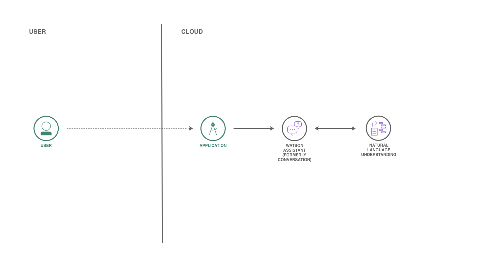

# Picard

[](https://cloud.ibm.com)
[](https://developer.ibm.com/node/)

A Chatbot that analyzes your sentiment and use it to answer appropriately. This application was designed and developed to help new developers to start using a webchat from boilerplate code.



## Components and technologies

* [Watson Assistant](https://cloud.ibm.com/catalog/services/watson-assistant): Watson Assistant lets you build conversational interfaces into any application, device, or channel.
* [Natural Language Understanding](https://cloud.ibm.com/catalog/services/natural-language-understanding): Use advanced NLP to analyze text and extract meta-data from content such as concepts, entities, keywords, categories, sentiment, emotion, relations, and semantic roles.
* [IBM Cloud Functions](https://cloud.ibm.com/openwhisk): FaaS (Function-as-a-Service) platform that executes functions in response to events. It is based on Apache Openwhisk project.

## Deployment

In order to deploy the code in a cloud platform, you need to install [Node.js](https://nodejs.org/). After the installation, you can follow the steps below.

### 1. Download the source code

```sh
git clone https://github.com/victorshinya/picard.git
cd picard
```

### 2. Install all dependencies and build the app

```sh
npm install
npm run build
```

### 3. Deploy to the cloud

```sh
ibmcloud cf push {your_app_name}
```

## Roadmap

- [x] Handle response type: text
- [ ] Handle response type: image
- [ ] Handle response type: options
- [ ] Handle response type: pause
- [ ] Record and receive audio
- [ ] Convert: speech to text
- [ ] Play audio
- [ ] Convert: text to speech

## License

Copyright 2019 Victor Shinya

Licensed under the Apache License, Version 2.0 (the "License").
